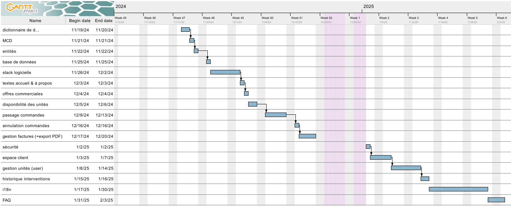
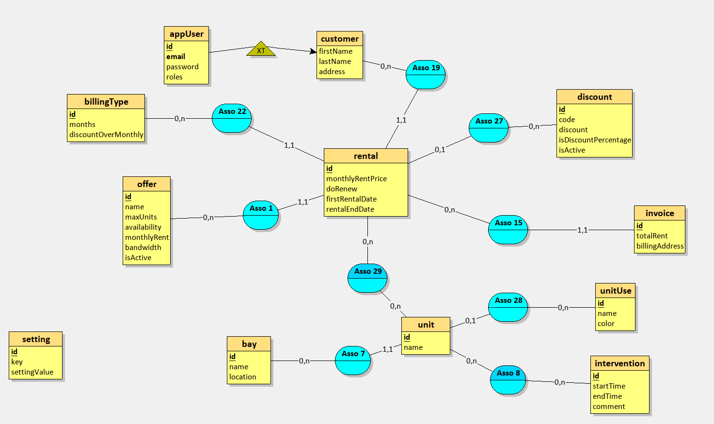
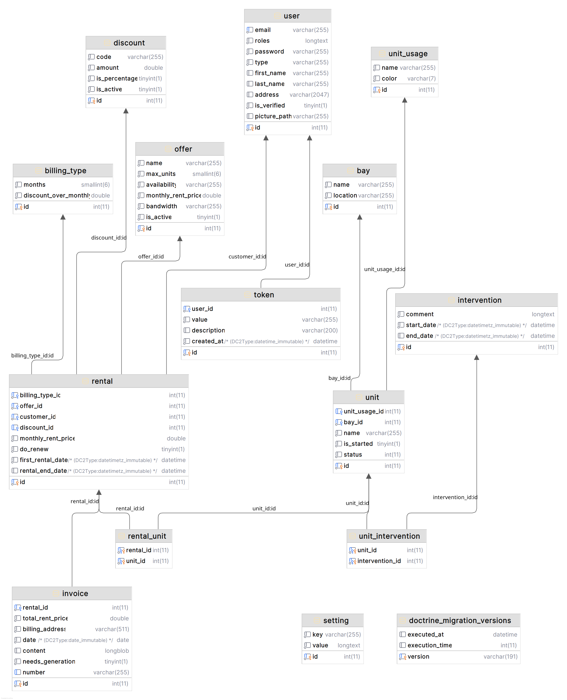

# Work Together - app web

## Description

Work Together est une application web permettant de louer des unités d'une baie de datacenter.
Vous pouvez consulter les unités disponibles, les réserver, les libérer et les gérer.

## Roadmap

- [x] Etablir un dictionnaire de données & des règles de gestion
- [x] Créer le MCD
- [x] Créer les entités
- [x] Créer la base de données & les tables
- [x] Mettre en place la stack logicielle avec Docker compose
- [x] Rédiger les textes de la page d'accueil & à propos
- [x] Afficher les offres commerciales
- [x] Gérer les commentaires clients pour les offres
- [x] Mettre en place la vérification de disponibilité des unités
- [x] Mettre en place les commandes (sans paiement)
- [x] Gérer les annulations de commandes
- [x] Gérer la génération de factures par PDF
- [x] Gérer l'authentification & les rôles
- [x] Créer l'espace client (avec gestion des données personnelles)
- [x] Mettre en place la gestion des unités, leur statut, leur prix, etc.
- [ ] Mettre en place l'affichage de l'état des unités en temps réel
- [ ] Ajouter l'historique des interventions
- [ ] Mettre en place les tests unitaires
- [ ] Internationalisation (français, anglais)
- [ ] Section FAQ



## Schéma de la base de données





## Prérequis

Une machine capable de lancer un projet Symfony (PHP, CLI Symfony, prérequis du CLI + extension PDO MongoDB, Composer), Git, Docker.

## Installation

Copier le fichier `.env.dist` en `.env` et modifier les variables d'environnement (notemment la chaîne de connection à la base de données).

Mettre à jour les ports des conteneurs dans `compose.override.yaml` si nécessaire.

```bash
docker compose up -d --build
```
```bash
docker exec -ti wt-app bash

php bin/console doctrine:migrations:migrate
```
